# [📈 Live Status](https://twelvebit.io): <!--live status--> **🟧 Partial outage**

This repository contains the open-source uptime monitor and status page for [twelvebit](https://twelvebit.io), powered by [Upptime](https://github.com/upptime/upptime).

With [Upptime](https://upptime.js.org), you can get your own unlimited and free uptime monitor and status page, powered entirely by a GitHub repository. We use [Issues](https://github.com/twelvebit-io/upptime/issues) as incident reports, [Actions](https://github.com/twelvebit-io/upptime/actions) as uptime monitors, and [Pages](https://twelvebit.io) for the status page.

<!--start: status pages-->
<!-- This summary is generated by Upptime (https://github.com/upptime/upptime) -->
<!-- Do not edit this manually, your changes will be overwritten -->
<!-- prettier-ignore -->
| URL | Status | History | Response Time | Uptime |
| --- | ------ | ------- | ------------- | ------ |
|  [Swapsicle Application](https://app.swapsicle.io/swap) | 🟥 Down | [swapsicle-application.yml](https://github.com/twelvebit-io/web-dashboard/commits/HEAD/history/swapsicle-application.yml) | 

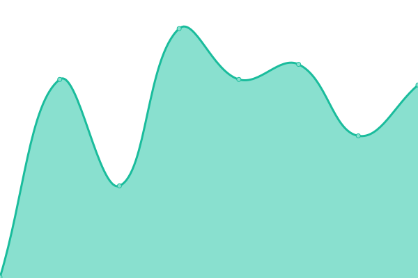 272ms
     
 | 

<a href="https://uptime.twelvebit.io/history/swapsicle-application">98.76%</a>
    

|  [Swapsicle Landing](https://www.swapsicle.io/) | 🟥 Down | [swapsicle-landing.yml](https://github.com/twelvebit-io/web-dashboard/commits/HEAD/history/swapsicle-landing.yml) | 

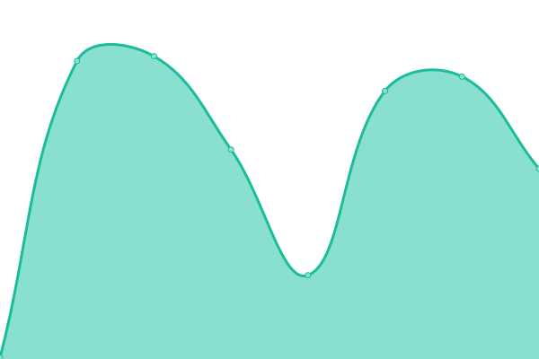 204ms
     
 | 

<a href="https://uptime.twelvebit.io/history/swapsicle-landing">98.78%</a>
    

|  [Swapsicle V1](https://v1.swapsicle.io/) | 🟥 Down | [swapsicle-v1.yml](https://github.com/twelvebit-io/web-dashboard/commits/HEAD/history/swapsicle-v1.yml) | 

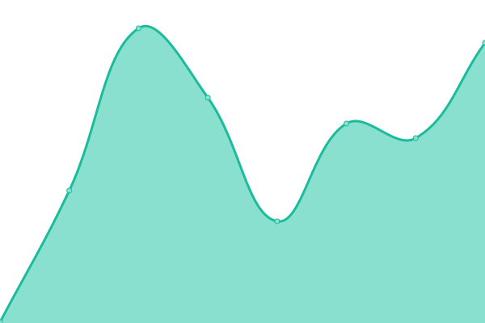 861ms
     
 | 

<a href="https://uptime.twelvebit.io/history/swapsicle-v1">98.79%</a>
    

|  [Swapsicle Analytics](https://analytics.swapsicle.io/) | 🟥 Down | [swapsicle-analytics.yml](https://github.com/twelvebit-io/web-dashboard/commits/HEAD/history/swapsicle-analytics.yml) | 

 180ms
     
 | 

<a href="https://uptime.twelvebit.io/history/swapsicle-analytics">98.81%</a>
    

|  [Twelvebit](https://twelvebit.io/) | 🟥 Down | [twelvebit.yml](https://github.com/twelvebit-io/web-dashboard/commits/HEAD/history/twelvebit.yml) | 

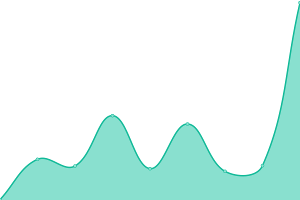 222ms
     
 | 

<a href="https://uptime.twelvebit.io/history/twelvebit">98.82%</a>
    

|  [Sambuca](https://sambucarestaurants.co.uk/) | 🟩 Up | [sambuca.yml](https://github.com/twelvebit-io/web-dashboard/commits/HEAD/history/sambuca.yml) | 

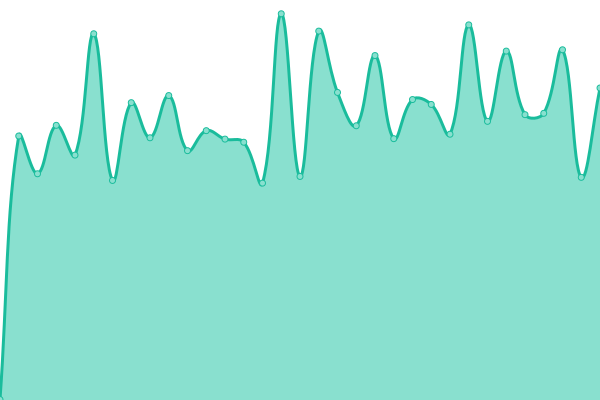 644ms
     
 | 

<a href="https://uptime.twelvebit.io/history/sambuca">99.66%</a>
    

|  [TelosX Landing](https://telosx.io/) | 🟥 Down | [telos-x-landing.yml](https://github.com/twelvebit-io/web-dashboard/commits/HEAD/history/telos-x-landing.yml) | 

 589ms
     
 | 

<a href="https://uptime.twelvebit.io/history/telos-x-landing">98.84%</a>
    

|  [Swapsicle Analytics Subgraph - Mantle](https://subgraph-api.mantle.xyz/api/public/f077c8d4-0d6c-42d4-9bbd-050948dc5c86/subgraphs/swapsicle/analytics/prod/gn) | 🟩 Up | [swapsicle-analytics-subgraph-mantle.yml](https://github.com/twelvebit-io/web-dashboard/commits/HEAD/history/swapsicle-analytics-subgraph-mantle.yml) | 

 1297ms
     
 | 

<a href="https://uptime.twelvebit.io/history/swapsicle-analytics-subgraph-mantle">100.00%</a>
    

|  [Swapsicle Analytics Subgraph - Mantle Testnet](https://subgraph-api.mantle.xyz/api/public/f077c8d4-0d6c-42d4-9bbd-050948dc5c86/subgraphs/swapsicle/analytics-testnet/prod/gn) | 🟩 Up | [swapsicle-analytics-subgraph-mantle-testnet.yml](https://github.com/twelvebit-io/web-dashboard/commits/HEAD/history/swapsicle-analytics-subgraph-mantle-testnet.yml) | 

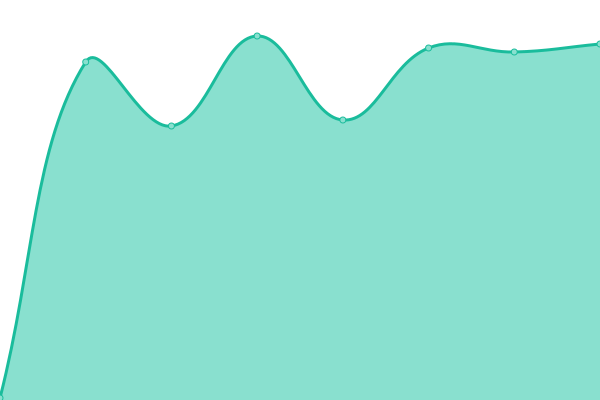 286ms
     
 | 

<a href="https://uptime.twelvebit.io/history/swapsicle-analytics-subgraph-mantle-testnet">100.00%</a>
    

|  [Swapsicle Analytics Subgraph - Telos](https://api.telos.0xgraph.xyz/api/public/f59149ee-c99a-41d0-afe4-1c86170a98b0/subgraphs/swapsicle/analytics/prod/gn) | 🟩 Up | [swapsicle-analytics-subgraph-telos.yml](https://github.com/twelvebit-io/web-dashboard/commits/HEAD/history/swapsicle-analytics-subgraph-telos.yml) | 

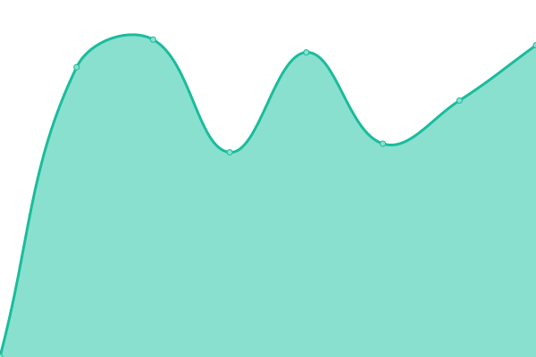 1232ms
     
 | 

<a href="https://uptime.twelvebit.io/history/swapsicle-analytics-subgraph-telos">100.00%</a>
    

|  [Swapsicle Analytics Subgraph - Telos Testnet](https://api.telos.0xgraph.xyz/api/public/f59149ee-c99a-41d0-afe4-1c86170a98b0/subgraphs/swapsicle/analytics-testnet/prod/gn) | 🟩 Up | [swapsicle-analytics-subgraph-telos-testnet.yml](https://github.com/twelvebit-io/web-dashboard/commits/HEAD/history/swapsicle-analytics-subgraph-telos-testnet.yml) | 

 248ms
     
 | 

<a href="https://uptime.twelvebit.io/history/swapsicle-analytics-subgraph-telos-testnet">100.00%</a>
    

|  [Swapsicle Analytics Subgraph - Taiko](https://api.goldsky.com/api/public/project_clr6mlufzbtuy01vd012wgt5k/subgraphs/swapsicle-analytics-taiko/prod/gn) | 🟩 Up | [swapsicle-analytics-subgraph-taiko.yml](https://github.com/twelvebit-io/web-dashboard/commits/HEAD/history/swapsicle-analytics-subgraph-taiko.yml) | 

 226ms
     
 | 

<a href="https://uptime.twelvebit.io/history/swapsicle-analytics-subgraph-taiko">100.00%</a>
    

|  [Swapsicle Analytics Subgraph - Taiko Testnet](https://api.goldsky.com/api/public/project_clr6mlufzbtuy01vd012wgt5k/subgraphs/swapsicle-analytics-taiko-hekla/prod/gn) | 🟩 Up | [swapsicle-analytics-subgraph-taiko-testnet.yml](https://github.com/twelvebit-io/web-dashboard/commits/HEAD/history/swapsicle-analytics-subgraph-taiko-testnet.yml) | 

 134ms
     
 | 

<a href="https://uptime.twelvebit.io/history/swapsicle-analytics-subgraph-taiko-testnet">100.00%</a>
    

|  [Swapsicle Farms Subgraph - Mantle](https://subgraph-api.mantle.xyz/api/public/f077c8d4-0d6c-42d4-9bbd-050948dc5c86/subgraphs/cryptoalgebra/farms/-/gn) | 🟩 Up | [swapsicle-farms-subgraph-mantle.yml](https://github.com/twelvebit-io/web-dashboard/commits/HEAD/history/swapsicle-farms-subgraph-mantle.yml) | 

 233ms
     
 | 

<a href="https://uptime.twelvebit.io/history/swapsicle-farms-subgraph-mantle">100.00%</a>
    

|  [Swapsicle Farms Subgraph - Mantle Testnet](https://subgraph-api.mantle.xyz/api/public/f077c8d4-0d6c-42d4-9bbd-050948dc5c86/subgraphs/swapsicle/farms-testnet/prod/gn) | 🟩 Up | [swapsicle-farms-subgraph-mantle-testnet.yml](https://github.com/twelvebit-io/web-dashboard/commits/HEAD/history/swapsicle-farms-subgraph-mantle-testnet.yml) | 

 213ms
     
 | 

<a href="https://uptime.twelvebit.io/history/swapsicle-farms-subgraph-mantle-testnet">100.00%</a>
    

|  [Swapsicle Farms Subgraph - Telos](https://api.telos.0xgraph.xyz/api/public/f59149ee-c99a-41d0-afe4-1c86170a98b0/subgraphs/swapsicle/farms/prod/gn) | 🟩 Up | [swapsicle-farms-subgraph-telos.yml](https://github.com/twelvebit-io/web-dashboard/commits/HEAD/history/swapsicle-farms-subgraph-telos.yml) | 

 218ms
     
 | 

<a href="https://uptime.twelvebit.io/history/swapsicle-farms-subgraph-telos">100.00%</a>
    

|  [Swapsicle Farms Subgraph - Telos Testnet](https://api.telos.0xgraph.xyz/api/public/f59149ee-c99a-41d0-afe4-1c86170a98b0/subgraphs/swapsicle/farms-testnet/prod/gn) | 🟩 Up | [swapsicle-farms-subgraph-telos-testnet.yml](https://github.com/twelvebit-io/web-dashboard/commits/HEAD/history/swapsicle-farms-subgraph-telos-testnet.yml) | 

 228ms
     
 | 

<a href="https://uptime.twelvebit.io/history/swapsicle-farms-subgraph-telos-testnet">100.00%</a>
    

|  [Swapsicle Farms Subgraph - Taiko](https://api.goldsky.com/api/public/project_clr6mlufzbtuy01vd012wgt5k/subgraphs/swapsicle-farms-taiko/prod/gn) | 🟩 Up | [swapsicle-farms-subgraph-taiko.yml](https://github.com/twelvebit-io/web-dashboard/commits/HEAD/history/swapsicle-farms-subgraph-taiko.yml) | 

 157ms
     
 | 

<a href="https://uptime.twelvebit.io/history/swapsicle-farms-subgraph-taiko">100.00%</a>
    

|  [Swapsicle Farms Subgraph - Taiko Testnet](https://api.goldsky.com/api/public/project_clr6mlufzbtuy01vd012wgt5k/subgraphs/swapsicle-farms-taiko-hekla/prod/gn) | 🟩 Up | [swapsicle-farms-subgraph-taiko-testnet.yml](https://github.com/twelvebit-io/web-dashboard/commits/HEAD/history/swapsicle-farms-subgraph-taiko-testnet.yml) | 

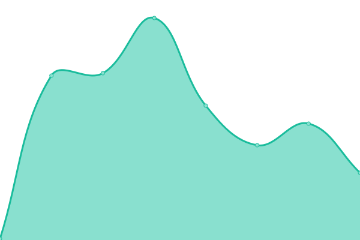 133ms
     
 | 

<a href="https://uptime.twelvebit.io/history/swapsicle-farms-subgraph-taiko-testnet">100.00%</a>
    

|  [Swapsicle Blocks Subgraph - Mantle](https://subgraph-api.mantle.xyz/api/public/f077c8d4-0d6c-42d4-9bbd-050948dc5c86/subgraphs/swapsicle/blocks/prod/gn) | 🟩 Up | [swapsicle-blocks-subgraph-mantle.yml](https://github.com/twelvebit-io/web-dashboard/commits/HEAD/history/swapsicle-blocks-subgraph-mantle.yml) | 

 279ms
     
 | 

<a href="https://uptime.twelvebit.io/history/swapsicle-blocks-subgraph-mantle">100.00%</a>
    

|  [Swapsicle Blocks Subgraph - Mantle Testnet](https://subgraph-api.mantle.xyz/api/public/f077c8d4-0d6c-42d4-9bbd-050948dc5c86/subgraphs/swapsicle/blocks-testnet/prod/gn) | 🟩 Up | [swapsicle-blocks-subgraph-mantle-testnet.yml](https://github.com/twelvebit-io/web-dashboard/commits/HEAD/history/swapsicle-blocks-subgraph-mantle-testnet.yml) | 

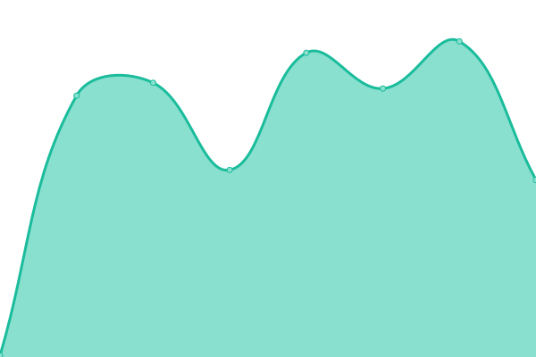 186ms
     
 | 

<a href="https://uptime.twelvebit.io/history/swapsicle-blocks-subgraph-mantle-testnet">100.00%</a>
    

|  [Swapsicle Blocks Subgraph - Telos](https://api.telos.0xgraph.xyz/api/public/f59149ee-c99a-41d0-afe4-1c86170a98b0/subgraphs/swapsicle/blocks/prod/gn) | 🟩 Up | [swapsicle-blocks-subgraph-telos.yml](https://github.com/twelvebit-io/web-dashboard/commits/HEAD/history/swapsicle-blocks-subgraph-telos.yml) | 

 312ms
     
 | 

<a href="https://uptime.twelvebit.io/history/swapsicle-blocks-subgraph-telos">100.00%</a>
    

|  [Swapsicle Blocks Subgraph - Telos Testnet](https://api.telos.0xgraph.xyz/api/public/f59149ee-c99a-41d0-afe4-1c86170a98b0/subgraphs/swapsicle/blocks-testnet/prod/gn) | 🟩 Up | [swapsicle-blocks-subgraph-telos-testnet.yml](https://github.com/twelvebit-io/web-dashboard/commits/HEAD/history/swapsicle-blocks-subgraph-telos-testnet.yml) | 

 272ms
     
 | 

<a href="https://uptime.twelvebit.io/history/swapsicle-blocks-subgraph-telos-testnet">100.00%</a>
    

|  [Swapsicle Blocks Subgraph - Taiko](https://api.goldsky.com/api/public/project_clr6mlufzbtuy01vd012wgt5k/subgraphs/swapsicle-blocks-taiko/prod/gn) | 🟩 Up | [swapsicle-blocks-subgraph-taiko.yml](https://github.com/twelvebit-io/web-dashboard/commits/HEAD/history/swapsicle-blocks-subgraph-taiko.yml) | 

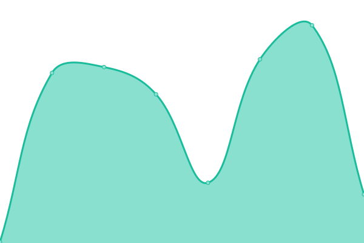 203ms
     
 | 

<a href="https://uptime.twelvebit.io/history/swapsicle-blocks-subgraph-taiko">100.00%</a>
    

|  [Swapsicle Blocks Subgraph - Taiko Testnet](https://api.goldsky.com/api/public/project_clr6mlufzbtuy01vd012wgt5k/subgraphs/swapsicle-blocks-taiko-hekla/prod/gn) | 🟩 Up | [swapsicle-blocks-subgraph-taiko-testnet.yml](https://github.com/twelvebit-io/web-dashboard/commits/HEAD/history/swapsicle-blocks-subgraph-taiko-testnet.yml) | 

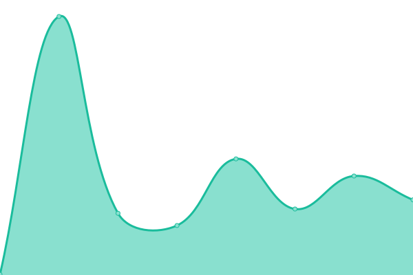 177ms
     
 | 

<a href="https://uptime.twelvebit.io/history/swapsicle-blocks-subgraph-taiko-testnet">100.00%</a>
    

|  [Swapsicle Ice Token Subgraph - Mantle](https://subgraph-api.mantle.xyz/api/public/f077c8d4-0d6c-42d4-9bbd-050948dc5c86/subgraphs/swapsicle/icetoken/prod/gn) | 🟩 Up | [swapsicle-ice-token-subgraph-mantle.yml](https://github.com/twelvebit-io/web-dashboard/commits/HEAD/history/swapsicle-ice-token-subgraph-mantle.yml) | 

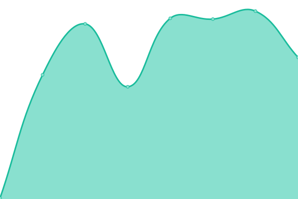 288ms
     
 | 

<a href="https://uptime.twelvebit.io/history/swapsicle-ice-token-subgraph-mantle">100.00%</a>
    

|  [Swapsicle Ice Token Subgraph - Mantle Testnet](https://subgraph-api.mantle.xyz/api/public/f077c8d4-0d6c-42d4-9bbd-050948dc5c86/subgraphs/swapsicle/icetoken-testnet/prod/gn) | 🟩 Up | [swapsicle-ice-token-subgraph-mantle-testnet.yml](https://github.com/twelvebit-io/web-dashboard/commits/HEAD/history/swapsicle-ice-token-subgraph-mantle-testnet.yml) | 

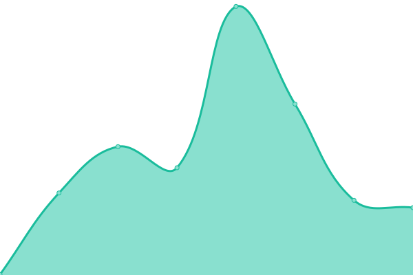 300ms
     
 | 

<a href="https://uptime.twelvebit.io/history/swapsicle-ice-token-subgraph-mantle-testnet">100.00%</a>
    

|  [Swapsicle Ice Token Subgraph - Telos](https://api.telos.0xgraph.xyz/api/public/f59149ee-c99a-41d0-afe4-1c86170a98b0/subgraphs/swapsicle/icetoken/prod/gn) | 🟩 Up | [swapsicle-ice-token-subgraph-telos.yml](https://github.com/twelvebit-io/web-dashboard/commits/HEAD/history/swapsicle-ice-token-subgraph-telos.yml) | 

 331ms
     
 | 

<a href="https://uptime.twelvebit.io/history/swapsicle-ice-token-subgraph-telos">100.00%</a>
    

|  [Swapsicle Ice Token Subgraph - Telos Testnet](https://api.telos.0xgraph.xyz/api/public/f59149ee-c99a-41d0-afe4-1c86170a98b0/subgraphs/swapsicle/icetoken-testnet/prod/gn) | 🟩 Up | [swapsicle-ice-token-subgraph-telos-testnet.yml](https://github.com/twelvebit-io/web-dashboard/commits/HEAD/history/swapsicle-ice-token-subgraph-telos-testnet.yml) | 

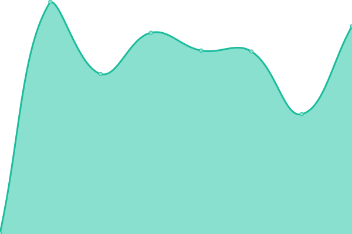 346ms
     
 | 

<a href="https://uptime.twelvebit.io/history/swapsicle-ice-token-subgraph-telos-testnet">100.00%</a>
    

|  [Swapsicle Ice Token Subgraph - Taiko](https://api.goldsky.com/api/public/project_clr6mlufzbtuy01vd012wgt5k/subgraphs/swapsicle-icetoken-taiko/prod/gn) | 🟩 Up | [swapsicle-ice-token-subgraph-taiko.yml](https://github.com/twelvebit-io/web-dashboard/commits/HEAD/history/swapsicle-ice-token-subgraph-taiko.yml) | 

 159ms
     
 | 

<a href="https://uptime.twelvebit.io/history/swapsicle-ice-token-subgraph-taiko">100.00%</a>
    

|  [Swapsicle Ice Token Subgraph - Taiko Testnet](https://api.goldsky.com/api/public/project_clr6mlufzbtuy01vd012wgt5k/subgraphs/swapsicle-icetoken-taiko-hekla/prod/gn) | 🟩 Up | [swapsicle-ice-token-subgraph-taiko-testnet.yml](https://github.com/twelvebit-io/web-dashboard/commits/HEAD/history/swapsicle-ice-token-subgraph-taiko-testnet.yml) | 

 163ms
     
 | 

<a href="https://uptime.twelvebit.io/history/swapsicle-ice-token-subgraph-taiko-testnet">100.00%</a>
    

<!--end: status pages-->

[**Visit our status website →**](https://twelvebit.io)

## 📄 License

- Powered by: [Upptime](https://github.com/upptime/upptime)
- Code: [MIT](./LICENSE) © [Anand Chowdhary](https://anandchowdhary.com), supported by [Pabio](https://pabio.com)
- Data in the `./history` directory: [Open Database License](https://opendatacommons.org/licenses/odbl/1-0/)
