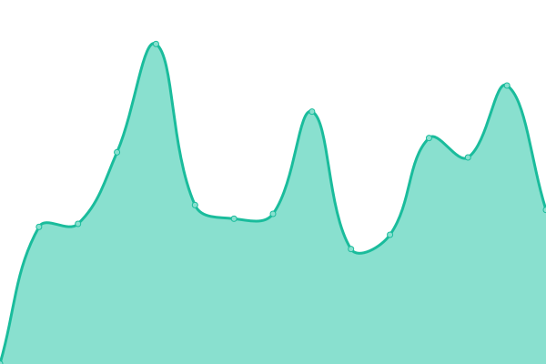

# [📈 Live Status](https://twelvebit.io): <!--live status--> **🟩 All systems operational**

This repository contains the open-source uptime monitor and status page for [twelvebit](https://twelvebit.io), powered by [Upptime](https://github.com/upptime/upptime).

With [Upptime](https://upptime.js.org), you can get your own unlimited and free uptime monitor and status page, powered entirely by a GitHub repository. We use [Issues](https://github.com/twelvebit-io/upptime/issues) as incident reports, [Actions](https://github.com/twelvebit-io/upptime/actions) as uptime monitors, and [Pages](https://twelvebit.io) for the status page.

<!--start: status pages-->
<!-- This summary is generated by Upptime (https://github.com/upptime/upptime) -->
<!-- Do not edit this manually, your changes will be overwritten -->
<!-- prettier-ignore -->
| URL | Status | History | Response Time | Uptime |
| --- | ------ | ------- | ------------- | ------ |
|  [Twelvebit](https://twelvebit.io/) | 🟩 Up | [twelvebit.yml](https://github.com/twelvebit-io/web-dashboard/commits/HEAD/history/twelvebit.yml) | 

 233ms
     
 | 

<a href="https://uptime.twelvebit.io/history/twelvebit">100.00%</a>
    

|  [Afyniti Landing](https://afyniti.xyz/) | 🟩 Up | [afyniti-landing.yml](https://github.com/twelvebit-io/web-dashboard/commits/HEAD/history/afyniti-landing.yml) | 

 282ms
     
 | 

<a href="https://uptime.twelvebit.io/history/afyniti-landing">100.00%</a>
    

|  [Afyniti](https://app.afyniti.xyz/) | 🟩 Up | [afyniti.yml](https://github.com/twelvebit-io/web-dashboard/commits/HEAD/history/afyniti.yml) | 

 186ms
     
 | 

<a href="https://uptime.twelvebit.io/history/afyniti">100.00%</a>
    

|  [Sambuca](https://sambucarestaurants.co.uk/) | 🟩 Up | [sambuca.yml](https://github.com/twelvebit-io/web-dashboard/commits/HEAD/history/sambuca.yml) | 

 689ms
     
 | 

<a href="https://uptime.twelvebit.io/history/sambuca">91.09%</a>
    

<!--end: status pages-->

[**Visit our status website →**](https://twelvebit.io)

## 📄 License

- Powered by: [Upptime](https://github.com/upptime/upptime)
- Code: [MIT](./LICENSE) © [Anand Chowdhary](https://anandchowdhary.com), supported by [Pabio](https://pabio.com)
- Data in the `./history` directory: [Open Database License](https://opendatacommons.org/licenses/odbl/1-0/)
